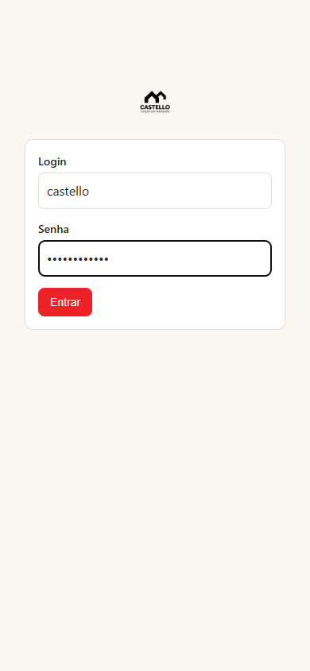
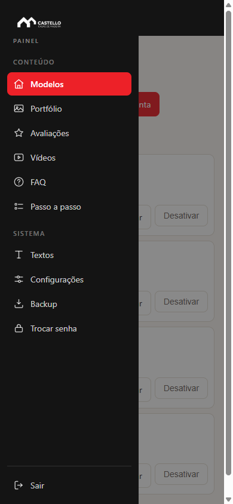
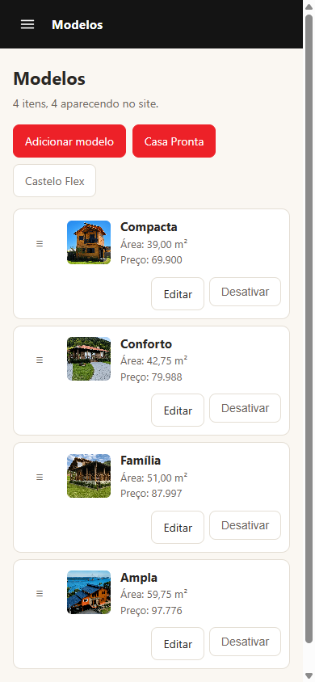
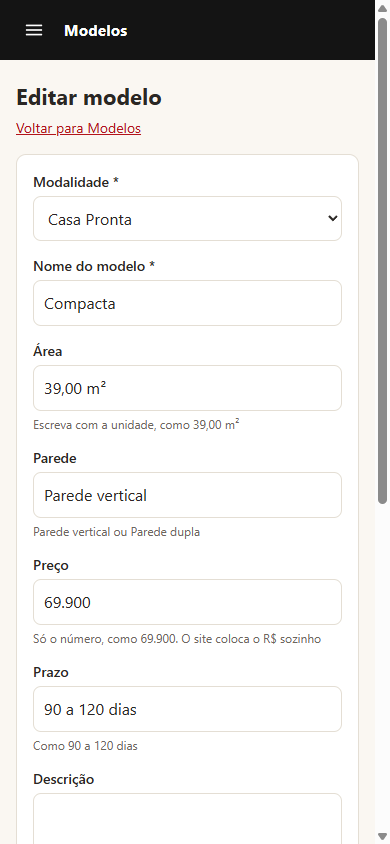

# Guia do painel do site Castello

Este guia é para quem cuida do conteúdo do site no dia a dia. Não precisa saber nada de programação: tudo é feito em telas simples, pelo navegador do computador ou do celular.

Endereço do painel: **https://castello.tohospedando.com.br/painel/** (muda quando o site for para o domínio definitivo; a Freela avisa).

## 1. Como entrar

1. Abra o endereço do painel.
2. Digite o login `castello` e a senha que a Freela entregou por outro canal.
3. Se este é o seu computador ou celular, marque **Salvar meu login e continuar conectado**.
4. Toque em **Entrar**.

Com a opção marcada, você fica dentro por 30 dias sem digitar a senha de novo, e cada visita renova o prazo. Não marque em computador compartilhado, de lan house ou de balcão: quem sentar depois de você entra direto no painel.

Errou a senha cinco vezes seguidas? O painel trava por 15 minutos para o seu endereço, por segurança. Espere e tente de novo. Sem a opção marcada, ficar duas horas parado também faz ele pedir a senha de novo.

Para sair, toque em **Sair**, no pé do menu da esquerda. Sair desliga o "continuar conectado" deste aparelho, mas o seu login continua preenchido na próxima vez.

## 2. As telas

O menu da esquerda tem uma tela para cada parte do site, em dois grupos. **Conteúdo** é o que aparece para quem visita. **Sistema** é a parte de configuração.

| Tela | O que muda no site |
|---|---|
| **Modelos** *(Conteúdo)* | Os cards de casa com área, parede e preço. Tem um filtro para Casa Pronta e outro para Castelo Flex. |
| **Portfólio** *(Conteúdo)* | A galeria de casas entregues. |
| **Avaliações** *(Conteúdo)* | Os depoimentos do Google que rolam na home. |
| **Vídeos** *(Conteúdo)* | Os vídeos do Instagram na home. |
| **FAQ** *(Conteúdo)* | As perguntas frequentes, da home (geral) e da página Flex. |
| **Passo a passo** *(Conteúdo)* | O passo a passo, da Casa Pronta (com foto) e da Flex (sem foto). |
| **Textos** *(Sistema)* | Títulos e textos avulsos: topo da home, bloco de modalidades, prazos, página Flex. |
| **Configurações** *(Sistema)* | E-mail que recebe os pedidos, quantos vídeos aparecem na home e o CRM. |
| **Backup** *(Sistema)* | Baixa uma cópia de tudo. |
| **Trocar senha** *(Sistema)* | Sua senha de acesso. |

No celular o menu fica escondido: toque no botão de três risquinhos, no canto superior esquerdo, para abrir.

## 3. Cadastrar um modelo de casa

1. Tela **Modelos**. Escolha o filtro **Casa Pronta** ou **Castelo Flex**.
2. Toque em **Adicionar modelo**.
3. Preencha:
   - **Modalidade**: Casa Pronta ou Castelo Flex.
   - **Nome do modelo**: como Compacta, Família.
   - **Área**: escreva com a unidade, como `39,00 m²`.
   - **Parede**: `Parede vertical` ou `Parede dupla`. Na Flex pode deixar vazio: o site mostra o prazo no lugar.
   - **Preço**: só o número, como `69.900`. O site coloca o R$ sozinho. Deixe vazio para o site mostrar **Sob consulta** (é assim que a Flex está hoje).
   - **Prazo**: como `90 a 120 dias` ou `45 dias`.
   - **Foto**: JPG, PNG ou WEBP, até 5 MB. Foto na horizontal fica melhor no card.
   - **Descrição da foto**: conte o que aparece na foto. Isso serve para quem usa leitor de tela e para o Google.
   - **Marcar como Mais escolhida**: destaca o card com o selo vermelho. Marque só um.
4. Toque em **Salvar**.

O modelo aparece no site na hora.

## 4. Subir um vídeo e mudar a ordem

1. Tela **Vídeos**, toque em **Adicionar vídeo**.
2. Escolha o arquivo **MP4** (até 30 MB) e uma **capa** (a imagem que aparece antes de o vídeo tocar).
3. Salve.

Para mudar a ordem, segure o item pela alça **≡** à esquerda e arraste para cima ou para baixo (funciona com o mouse e com o dedo no celular). Solte e a ordem é salva sozinha. A ordem da lista é a ordem do site.

**Por que existe um limite de vídeos na home.** Cada vídeo pesa alguns megabytes. Se todos carregassem de uma vez, a página ficaria lenta, principalmente no celular com internet fraca, e quem chega pelo anúncio vai embora antes de ver a casa. Por isso a home mostra só os primeiros da lista: hoje, 8. Os demais continuam cadastrados. Para trocar quais aparecem, mude a ordem. Para mudar quantos aparecem, vá em **Configurações**, campo **Quantos vídeos aparecem na home**. Quanto mais vídeos, mais devagar a página carrega.

## 5. Publicar uma avaliação

1. Tela **Avaliações**, toque em **Adicionar avaliação**.
2. Copie o **nome do cliente** e o **texto** exatamente como está no Google. Não resuma nem corrija: é o depoimento da pessoa.
3. **Estrelas**: de 1 a 5.
4. Salve. A avaliação nova entra no fim do carrossel; arraste na lista se quiser que apareça antes.

## 6. Desativar um item sem apagar

Não existe botão de apagar. Existe **Desativar**: o item sai do site mas continua no painel, e você pode **Reativar** quando quiser. Serve para tirar um modelo do ar enquanto o preço muda, esconder um vídeo antigo ou pausar uma avaliação sem perder nada.

Os itens desativados aparecem no fim da lista, marcados como inativos.

## 7. Editar os textos

Tela **Textos**. Cada campo tem um rótulo dizendo onde ele aparece no site, por exemplo *Título do topo* ou *Prazo da Castelo Flex*. Mude o que quiser e toque em **Salvar textos**.

Dois detalhes:

- Para deixar um trecho em **vermelho de destaque**, coloque entre asteriscos: `pronta pra morar, *chave na mão*` faz "chave na mão" sair em vermelho. Funciona nos títulos do topo da home e da página Flex.
- Os prazos (**90 a 120 dias** e **45 dias**) estão aqui. Mudou o prazo? Mude no Textos e o site inteiro acompanha.

## 8. Configurações

- **E-mail que recebe aviso de pedido novo**: cada pedido de orçamento do site chega neste e-mail, com todos os dados e um link para responder no WhatsApp.
- **Quantos vídeos aparecem na home**: veja a seção 4.
- **CRM**: veja a seção 8.1, logo abaixo. É a parte mais delicada desta tela.

### 8.1 O CRM (Agendor)

Quando o campo **Enviar os pedidos para o CRM** (primeira linha da tabela abaixo) está ligado, todo pedido de orçamento do site também entra no Agendor, o CRM que a equipe comercial usa todo dia, junto com os leads que já chegam pelo Instagram e pelo Facebook. Oito campos controlam se isso acontece e, quando acontece, para onde e como cada pedido entra lá:

| Campo | Para que serve |
|---|---|
| **Enviar os pedidos para o CRM** | Liga e desliga o envio ao Agendor. Desligado, o pedido continua sendo gravado no site e o e-mail de aviso continua saindo do mesmo jeito, exatamente como se o CRM não existisse. Nenhum pedido se perde nunca, ligado ou desligado. É o estado seguro para deixar enquanto qualquer um dos campos abaixo está sendo conferido. |
| **Funil do Agendor** | Em qual funil de vendas o negócio nasce. Vem certo de fábrica e normalmente não precisa mudar. |
| **Etapa onde o pedido entra** | Em qual coluna do funil o negócio nasce (hoje, "Contato"). Vem certo de fábrica. |
| **Origem do contato** | O código que o Agendor usa para marcar "veio do site". Vem certo de fábrica. |
| **Categoria do contato** | O código da categoria do contato no Agendor (hoje, "Cliente em potencial"). Vem certo de fábrica. |
| **Marcador no título do negócio** | O texto na frente do título de cada negócio no funil, como `[SITE]`, para a equipe separar de longe o que veio do site do que veio do Instagram ou do Facebook (que chegam marcados `[META]`). |
| **Responsável pelos pedidos do site** | Qual vendedor do Agendor recebe os pedidos do site. Vazio deixa cair na conta principal, para alguém distribuir na mão. |
| **Segundos de espera pelo CRM** | Quanto tempo o site espera o Agendor responder antes de desistir e deixar o pedido para a próxima tentativa automática. É um ajuste técnico; não costuma precisar mexer. |

**Por que Funil e Etapa merecem atenção redobrada.** Se um desses dois números estiver errado, o Agendor não avisa com erro nenhum. Ele simplesmente guarda o negócio num funil ou numa etapa que ninguém está olhando naquele momento, e o pedido some da visão de quem vende, mesmo estando lá dentro do Agendor o tempo todo. Não é um pedido perdido (ele existe, e o e-mail de aviso continua chegando), mas é um pedido que o time comercial não vê onde deveria ver.

Por isso, antes de mudar Funil ou Etapa, confirme o número certo direto no Agendor (ou peça para a Freela conferir), e depois de mudar, envie um pedido de teste pelo próprio site para conferir que ele aparece no lugar certo do funil.

## 9. Baixar o backup

Tela **Backup**, toque em **Baixar backup agora**. Vem um arquivo `.zip` com o banco de dados (todos os textos, modelos, avaliações e pedidos) e todas as fotos e vídeos enviados pelo painel. Guarde em um lugar seguro, fora do computador do escritório, uma vez por mês ou depois de uma mudança grande.

## 10. Trocar a senha

Tela **Trocar senha**. Precisa da senha atual, da nova (mínimo 8 caracteres) e da confirmação. Use uma senha que não use em mais nada.

Trocar a senha desconecta todos os aparelhos que estavam com o "continuar conectado" ligado, inclusive o que você está usando. É de propósito: se a senha antiga vazou, a nova precisa expulsar quem estava dentro. Entre de novo com a senha nova.

Esqueceu a senha? Não existe "esqueci minha senha" no painel, de propósito. Fale com a Freela, que redefine.

## Dúvidas

Freela In Home, freelainhome@gmail.com.
